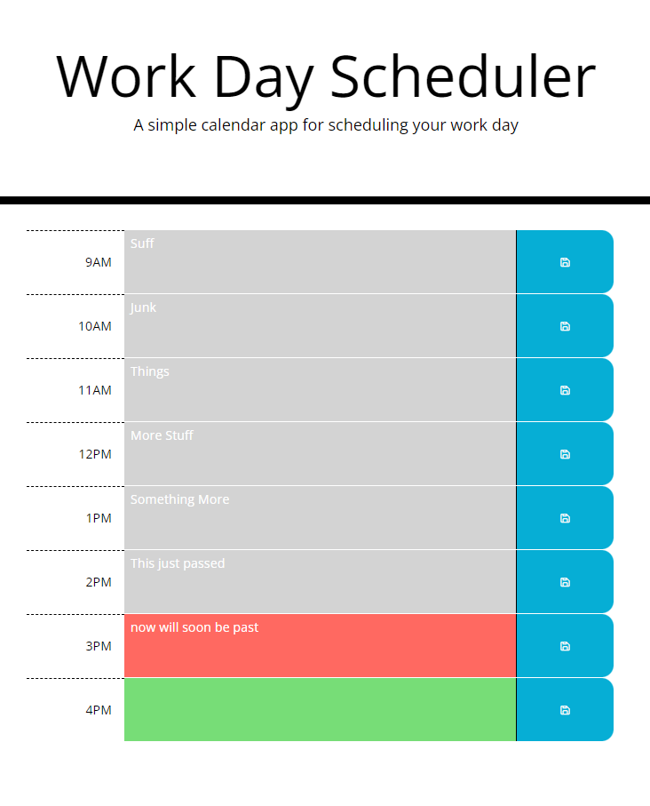

# Workday Scheduler

## Description

A simple time-management organizer for today's workday.

## Features

- Schedule, edit and delete events within time blocks in standard business hours 
- Move events across time blocks
- Time block colors adjust as the day progresses
- Sort events by dragging between time-blocks

## Website

[View the Live Site Here](https://scottrohrig.github.io/workday-scheduler/)

## Built With

### &copy; 2021 Workday Scheduler
